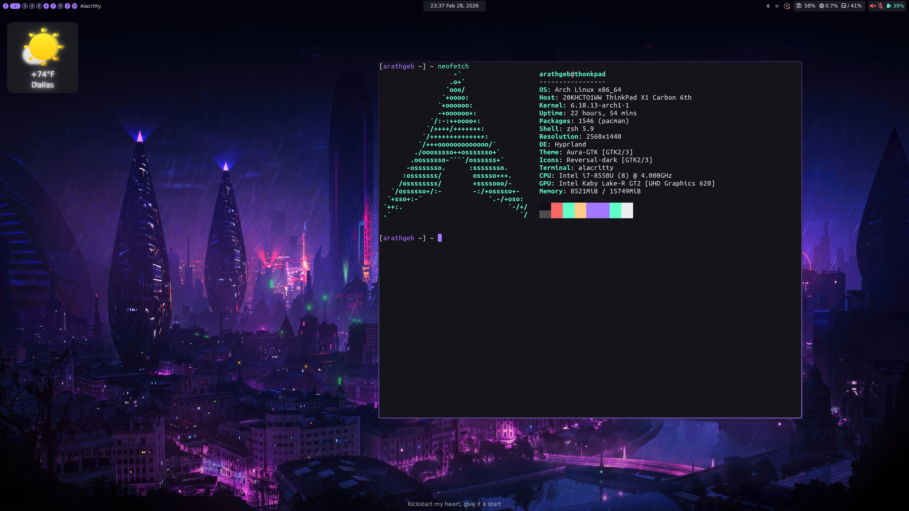
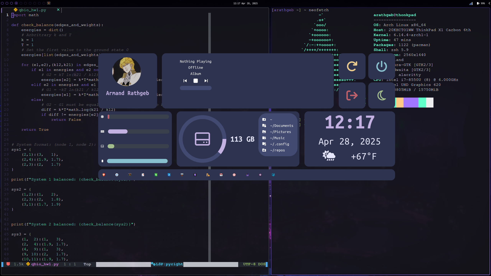

# Dotfiles
My dotfiles for my arch linux system

## Details
- **WM:** [Hyprland](https://hyprland.org/)
- **OS:** [Arch](https://archlinux.org/)
- **Terminal:** [Alacritty](https://alacritty.org/)
- **Widgets:** [EWW](https://github.com/elkowar/eww)
- **Browser:** [brave](https://brave.com/)
- **Editor:** [neovim](https://neovim.io/)
- **File manager:** [thunar](https://docs.xfce.org/xfce/thunar/start)
- **App launcher:** [fuzzel](https://codeberg.org/dnkl/fuzzel)
- 

## Setup
Assuming that you have `paru` installed as your package manager, you can just run `install.sh`.
Otherwise, manually install all of the packages listed therein.